# ☁️ Azure Resume Project - Cloud Resume Challenge

[](https://github.com/abidaslam892/Azure-Resume-Project/actions/workflows/frontend.yml)
[](https://github.com/abidaslam892/Azure-Resume-Project/actions/workflows/backend.yml)
[](./SECURITY.md)
[](https://azure.microsoft.com/)

> **🌐 Live Demo**: [https://resume-endpoint-gmd7e5g9f8c6gqgs.z01.azurefd.net/](https://resume-endpoint-gmd7e5g9f8c6gqgs.z01.azurefd.net/)

A complete implementation of the **Cloud Resume Challenge** using Microsoft Azure services. This project demonstrates modern cloud architecture, DevOps practices, and full-stack development with enterprise-grade security and automation.

## 👨‍💼 Professional Profile

**Abid Aslam** - Solution Architect | 15+ Years Experience  
📧 **Email**: abidaslam.123@gmail.com  
📱 **Phone**: +92 311 5644948  
🌍 **Location**: Pakistan  
💼 **Expertise**: Telecom & Cloud Operations, DevOps Architecture

## 🏗️ Architecture Overview

```mermaid
graph TB
    A[👤 User Browser] --> B[🌐 Azure Front Door CDN]
    B --> C[📄 Azure Storage Static Website]
    C --> D[⚡ JavaScript Visitor Counter]
    D --> E[🔧 Azure Functions API]
    E --> F[🗄️ CosmosDB Table Storage]
    
    G[📦 GitHub Repository] --> H[🔄 GitHub Actions CI/CD]
    H --> C
    H --> E
    
    I[🔒 GitHub Secrets] --> H
    J[🛡️ Service Principal] --> I
```



### 🔧 Azure Services Architecture

| Service | Purpose | SKU/Configuration | Monthly Cost |
|---------|---------|-------------------|--------------|
| **Azure Storage** | Static website hosting | Standard LRS | ~$2-3 |
| **Azure Front Door** | Global CDN + SSL/TLS | Standard tier | ~$12-15 |
| **Azure Functions** | Serverless API backend | Consumption plan | ~$5-8 |
| **CosmosDB** | Visitor counter database | Table API, 400 RU/s | ~$8-12 |
| **Application Insights** | Monitoring & analytics | Pay-as-you-go | ~$1-2 |
| **Total** | **Complete infrastructure** | **Production-ready** | **~$28-30** |

## 📋 Challenge Requirements Completed

### ✅ Frontend (Requirements 1-6)
- [x] **HTML Resume** - Semantic HTML5 structure
- [x] **CSS Styling** - Modern responsive design  
- [x] **Azure Storage Static Website** - Hosted on Azure Blob Storage
- [x] **HTTPS** - Secured via Azure CDN
- [x] **Custom DNS** - Custom domain with Azure DNS
- [x] **JavaScript** - Dynamic visitor counter

### ✅ Backend (Requirements 7-11)
- [x] **CosmosDB Database** - Table API for visitor count storage
- [x] **Azure Functions API** - HTTP triggered Python function
- [x] **Python Code** - Backend logic with Azure SDK
- [x] **Unit Tests** - Comprehensive test coverage
- [x] **Integration Tests** - End-to-end API testing

### ✅ Infrastructure & DevOps (Requirements 12-15)
- [x] **Infrastructure as Code** - ARM templates for all resources
- [x] **Source Control** - Dual GitHub repositories
- [x] **Backend CI/CD** - GitHub Actions with automated testing
- [x] **Frontend CI/CD** - Automated deployment to Azure Storage

## 🏗️ Architecture

```
┌─────────────────┐    ┌──────────────────┐    ┌─────────────────┐
│   Custom DNS    │    │   Azure CDN      │    │  Azure Storage  │
│  (Azure DNS)    │───▶│     (HTTPS)      │───▶│ Static Website  │
└─────────────────┘    └──────────────────┘    └─────────────────┘
                                │                        │
                                │                        │
                                ▼                        │
┌─────────────────┐    ┌──────────────────┐             │
│    Visitor      │    │ Azure Functions  │             │
│   (Browser)     │───▶│   Python API     │◀────────────┘
└─────────────────┘    └──────────────────┘
                                │
                                ▼
                       ┌──────────────────┐
                       │   CosmosDB       │
                       │   Table API      │
                       └──────────────────┘
```

## 📁 Project Structure

```
cloud-resume-challenge-azure/
├── 📁 frontend/                    # Frontend repository content
│   ├── index.html                  # Resume HTML
│   ├── styles.css                  # Responsive CSS
│   ├── script.js                   # Visitor counter JS
│   └── .github/workflows/          # Frontend CI/CD
│       └── frontend.yml
├── 📁 backend/                     # Backend repository content  
│   ├── api/
│   │   ├── __init__.py
│   │   ├── function_app.py         # Azure Function
│   │   └── requirements.txt
│   ├── tests/
│   │   ├── test_api.py             # Unit tests
│   │   └── test_integration.py     # Integration tests
│   ├── infrastructure/
│   │   ├── azuredeploy.json        # ARM template
│   │   └── azuredeploy.parameters.json
│   └── .github/workflows/          # Backend CI/CD
│       └── backend.yml
├── 📁 docs/                        # Documentation
│   ├── SETUP.md                    # Setup instructions
│   ├── DEPLOYMENT.md               # Deployment guide
│   └── ARCHITECTURE.md             # Architecture details
└── 📁 scripts/                     # Utility scripts
    ├── setup-azure.sh              # Azure resource setup
    ├── deploy-frontend.sh          # Frontend deployment
    └── deploy-backend.sh           # Backend deployment
```

## 🚀 Quick Start

### Prerequisites
- ✅ Azure subscription ([Get free account](https://azure.microsoft.com/free/))
- ✅ GitHub account with repository access
- ✅ Azure CLI installed ([Installation guide](https://docs.microsoft.com/en-us/cli/azure/install-azure-cli))
- ✅ Git for version control

### 🎯 Easy Setup (Recommended)

#### Option 1: Interactive Setup (5 minutes)
```bash
# Clone the repository
git clone https://github.com/YOUR_USERNAME/cloud-resume-challenge-azure.git
cd cloud-resume-challenge-azure

# Run the interactive setup wizard
./scripts/deploy-master.sh
```

The interactive wizard will guide you through:
1. 🏗️ Azure infrastructure deployment
2. 🔐 GitHub secrets configuration  
3. 🧪 Setup verification
4. 🚀 Application deployment

#### Option 2: Manual Setup

```bash
# 1. Login to Azure
az login

# 2. Deploy Azure infrastructure
./scripts/setup-azure.sh

# 3. Configure GitHub secrets
./scripts/configure-github-secrets.sh

# 4. Verify setup
./scripts/verify-azure-setup.sh
```

### 📋 GitHub Secrets Configuration

After running the setup scripts, add these secrets to your GitHub repository:

1. Go to your repository **Settings** → **Secrets and variables** → **Actions**
2. Add the following secrets (values provided by setup scripts):

| Secret Name | Description | Source |
|-------------|-------------|---------|
| `AZURE_CREDENTIALS` | Service principal JSON | `azure-credentials.json` |
| `AZURE_RESOURCE_GROUP` | Resource group name | `rg-cloud-resume` |
| `AZURE_FUNCTIONAPP_PUBLISH_PROFILE` | Function app deployment profile | `function-app-publish-profile.xml` |
| `AZURE_STORAGE_ACCOUNT` | Storage account name | Setup script output |
| `AZURE_FUNCTIONAPP_NAME` | Function app name | Setup script output |

### 🔧 Manual Deployment

After configuring secrets, deploy your application:

```bash
# Deploy backend API
./scripts/deploy-backend.sh

# Deploy frontend website  
./scripts/deploy-frontend.sh
```

Or simply push to GitHub to trigger automated deployment:

```bash
git add .
git commit -m "Deploy Cloud Resume Challenge"
git push origin main
```

### 📊 Verify Deployment

```bash
# Run comprehensive verification
./scripts/verify-azure-setup.sh

# Check your live website
echo "Visit your website at: $(az storage account show --name YOUR_STORAGE_ACCOUNT --resource-group rg-cloud-resume --query 'primaryEndpoints.web' -o tsv)"
```

## 💰 Cost Estimation

| Service | Monthly Cost | Notes |
|---------|--------------|-------|
| Azure Storage | ~$0.50 | Static website hosting |
| Azure CDN | ~$0.25 | HTTPS and caching |
| Azure Functions | ~$0.00 | Consumption plan (free tier) |
| CosmosDB | ~$0.25 | Serverless mode |
| Azure DNS | ~$0.50 | DNS zone hosting |
| **Total** | **~$1.50** | **Very cost effective!** |

## 🛡️ Security Features

- ✅ HTTPS everywhere via Azure CDN
- ✅ CORS properly configured
- ✅ No credentials in source control
- ✅ Managed identities for Azure services
- ✅ Input validation and sanitization
- ✅ Rate limiting on API endpoints

## 📊 Monitoring & Analytics

- Azure Application Insights for API monitoring
- Azure CDN analytics for website traffic
- Custom metrics for visitor counter accuracy
- Automated alerting for API failures

## 🧪 Testing Strategy

### Frontend Testing
- HTML validation
- CSS linting
- JavaScript unit tests
- Cross-browser compatibility

### Backend Testing
- Unit tests for business logic
- Integration tests for Azure services
- Load testing for API endpoints
- Security testing for vulnerabilities

## 📚 Learning Resources

- [Azure Static Web Apps Documentation](https://docs.microsoft.com/en-us/azure/static-web-apps/)
- [Azure Functions Python Developer Guide](https://docs.microsoft.com/en-us/azure/azure-functions/functions-reference-python)
- [Azure CosmosDB Table API](https://docs.microsoft.com/en-us/azure/cosmos-db/table/introduction)
- [GitHub Actions for Azure](https://docs.microsoft.com/en-us/azure/developer/github/)

## 🤝 Contributing

1. Fork the repository
2. Create a feature branch
3. Make your changes
4. Add tests for new functionality
5. Ensure all tests pass
6. Submit a pull request

## 📄 License

This project is licensed under the MIT License - see the [LICENSE](LICENSE) file for details.

## 🏆 Acknowledgments

- [Forrest Brazeal](https://twitter.com/forrestbrazeal) for creating the Cloud Resume Challenge
- The Azure community for excellent documentation and examples
- Contributors who helped improve this implementation

---

**🎯 This project demonstrates:**
- Modern cloud architecture patterns
- Infrastructure as Code best practices  
- CI/CD pipeline implementation
- Full-stack development skills
- Cost-effective cloud resource usage